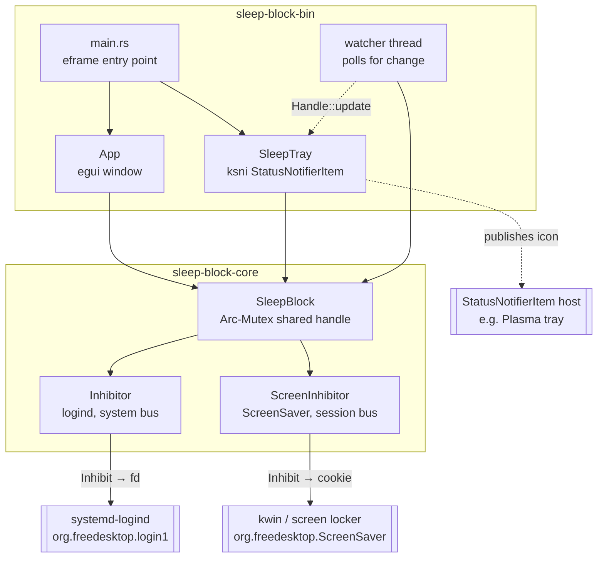
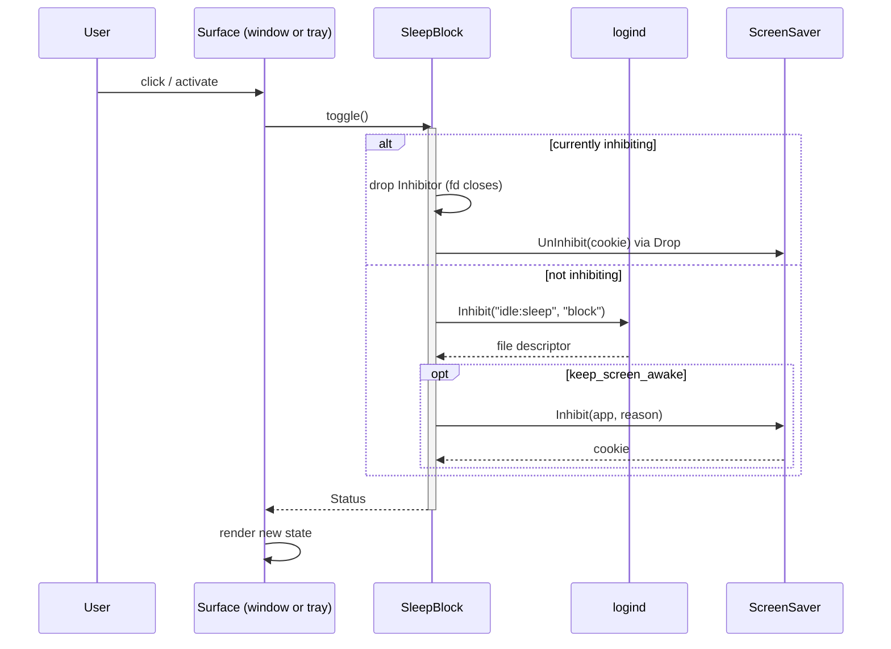
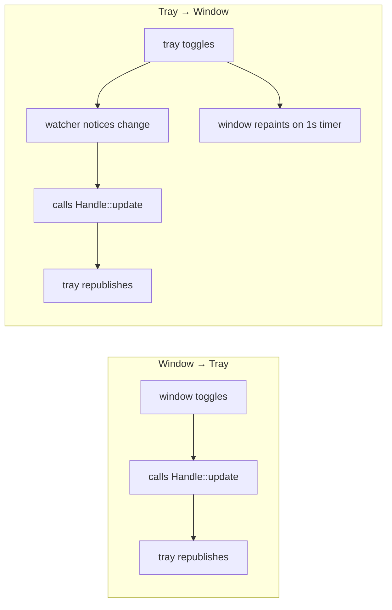

# Sleep Block — Architecture and Design

## Overview

Sleep Block is a two-crate Rust workspace. `sleep-block-core` owns every D-Bus
interaction and all inhibitor state; `sleep-block-bin` renders that state through
two independent surfaces — an `egui` window and a StatusNotifierItem tray icon.

The split exists for a concrete reason rather than tidiness: the inhibitor logic
is testable headlessly against live D-Bus services, while the GUI is not testable
in this environment at all (no compositor is reachable from the build sandbox).
Keeping the mechanism in a GUI-free crate is what makes **AC-01** through
**AC-05** possible.

This design is retrospective and documents the system as built.

## Non-Goals

- **No abstraction over the two inhibitor mechanisms.** They differ in bus,
  interface, and release semantics (**FR-03** vs **FR-05**). A unifying trait
  would hide exactly the distinction that causes bugs here, so the two types stay
  separate and are composed by the state layer instead.
- **No notification/observer machinery in `SleepBlock`.** Only the tray needs to
  learn about out-of-band changes, and it can poll cheaply. Building a general
  subscription mechanism for one consumer would be unearned generality.
- **No persistence layer.** Per the spec's non-goals, state is process-lifetime
  only.
- **No plugin or backend abstraction for desktops.** The ScreenSaver interface is
  a freedesktop standard; desktops that implement it work, and those that do not
  degrade per **FR-13**/**C-04**.

## Architecture

### Components

`SleepBlock` is the single source of truth (**FR-09**). Both surfaces hold clones
of the same handle, not copies of the locks.

### Data Flow

A toggle originating from either surface follows the same path, which is what
makes the two peers rather than a primary and a mirror:

Propagation to the *other* surface differs by direction, and this asymmetry is
the subtlest part of the design:

### Interfaces

`sleep-block-core` exposes four public items:

| Item | Role |
|---|---|
| `Inhibitor` | Holds a sleep lock. Releases on drop by closing its descriptor. |
| `ScreenInhibitor` | Holds a screen-lock cookie. Releases on drop via `UnInhibit`. |
| `SleepBlock` | Cloneable handle to shared state. `toggle`, `set_keep_screen_awake`, `snapshot`, `release_all`. |
| `Status` | Plain copyable snapshot: `sleep_blocked`, `screen_blocked`, `keep_screen_awake`. |

`snapshot` returns `Status` **by value** so no lock is held across a repaint
(**NFR-06**). Exposing the guard would have made that mistake easy to make.

### Requirement Realisation

Where each requirement is realised in this design:

| Requirement | Realised by |
|---|---|
| **FR-01**, **FR-02** | `Inhibitor` — `login1.Manager.Inhibit` with `idle:sleep` / `block`, identifying as `sleep-block`. |
| **FR-03** | `Inhibitor` holds the returned descriptor; no explicit release path exists, so exit always releases. |
| **FR-04**, **FR-05** | `ScreenInhibitor` — `ScreenSaver.Inhibit`, with `Drop` calling `UnInhibit`. |
| **FR-06** | `SleepBlock` guards screen acquisition on the sleep inhibitor being held. |
| **FR-07** | `App` — circular indicator plus screen-lock checkbox. |
| **FR-08** | `SleepTray` — state-dependent `icon_pixmap`, toggling on `activate`. |
| **FR-09** | `SleepBlock` as the single shared handle; see Decision 3. |
| **FR-10** | `SleepTray::menu` — toggle, screen-lock checkmark, and quit that calls `release_all`. |
| **FR-11**, **FR-12** | Error table below: failures leave prior state intact; screen-lock failure retains sleep blocking. |
| **FR-13** | `SleepTray::start` returns `None` and the window continues alone. |
| **FR-14**, **FR-15** | Packaging: desktop entry plus hicolor icons, staged into a binary RPM. |
| **NFR-01** | Pure-Rust dependency set; see Decision 5 and the Constraints in the spec. |
| **NFR-02**, **NFR-03** | Two icon states differing in colour and saturation, verified at 22px on both backgrounds. |
| **NFR-04** | Indicator uses fill/outline and text alongside colour. |
| **NFR-05** | Release profile: fat LTO, `codegen-units = 1`, symbols stripped. |
| **NFR-06** | `snapshot` returns `Status` by value; no guard escapes. |
| **NFR-07** | `make check` gates `make package` on tests, clippy, fmt, and desktop validation. |

## Design Decisions

### Decision 1: Call the D-Bus API directly rather than spawning `systemd-inhibit`

**Context:** The lock could be obtained by running `systemd-inhibit` as a child
process and keeping it alive.

**Options Considered:**
1. Spawn `systemd-inhibit --what=idle:sleep` and hold the child.
2. Call `org.freedesktop.login1.Manager.Inhibit` over D-Bus directly.

**Decision:** Option 2.

**Rationale:** The subprocess approach makes lock lifetime depend on child
process management, adds a runtime dependency on the binary being installed, and
leaves an orphan risk if the parent dies abnormally. Calling the API directly
ties the lock to a file descriptor the kernel closes on process exit — the
release path is then impossible to get wrong (**FR-03**). It is also the same
call `systemd-inhibit` itself makes, so nothing is lost.

### Decision 2: Two separate inhibitor types, not one abstraction

**Context:** Sleep and screen-lock inhibition are superficially similar —
acquire a lock, release it later.

**Options Considered:**
1. One `Inhibitor` trait with two implementations.
2. Two concrete types composed by the state layer.

**Decision:** Option 2.

**Rationale:** The similarity is superficial and the differences are precisely
where bugs live. The logind lock is self-releasing via its descriptor; the
ScreenSaver cookie leaks unless `UnInhibit` is called explicitly, which is why
only `ScreenInhibitor` carries a `Drop` impl. A shared trait would have obscured
that asymmetry behind a uniform interface and invited treating them
interchangeably. They also live on different buses and are governed by different
requirements (**FR-01** vs **FR-04**).

### Decision 3: `SleepBlock` as a shared handle rather than GUI-owned state

**Context:** Initially the window owned the inhibitors directly. Adding a tray
that can toggle independently (**FR-09**) broke that model, since `ksni` runs the
tray on its own thread.

**Options Considered:**
1. Tray sends messages to the GUI thread, which remains the owner.
2. Both surfaces share an `Arc<Mutex<…>>` handle.

**Decision:** Option 2.

**Rationale:** Option 1 makes the tray depend on the window being alive and
responsive, which contradicts the peer model — a tray toggle would stall if the
window were busy. Sharing the state makes neither surface privileged. The mutex
is uncontended in practice: it is held only for the duration of a state
transition or a field copy, never across I/O or a repaint.

### Decision 4: A watcher thread to republish tray state

**Context:** A left click on the tray icon arrives as a D-Bus `Activate`, which
mutates state through `SleepTray::activate`. The icon did not update.

**Options Considered:**
1. Call `Handle::update` from inside `activate`.
2. A background thread that polls the shared state and calls `Handle::update` on
   change.
3. Add change notification to `SleepBlock`.

**Decision:** Option 2.

**Rationale:** Option 1 is impossible — the tray does not hold its own handle,
which only exists after `spawn` returns. `ksni` republishes properties only in
response to an explicit `Handle::update`, and a D-Bus method call does not
trigger one, so without this the icon silently shows the previous state. Option 3
would add subscription machinery to the core crate for a single consumer. The
poll is 250 ms and compares a three-field `Copy` struct, which is far cheaper
than the notification infrastructure it replaces.

### Decision 5: `async-io` backend rather than `tokio`

**Context:** `ksni` defaults to a tokio runtime.

**Options Considered:**
1. Accept the tokio default.
2. Configure `ksni` for `async-io` to match `zbus`.

**Decision:** Option 2.

**Rationale:** `zbus` — already a dependency of the core crate — defaults to the
`async-io` backend. Measured, the tokio default puts *both* runtimes in the tree
(496 dependency lines, tokio and async-io present) against 490 lines with
async-io alone. Tokio would therefore not replace async-io but run a second
executor in the same process. The dependency-count difference is negligible; the
second-executor argument is the deciding one. Nothing in this application is
async at the application level, so the runtime is pure substrate either way.

### Decision 6: Embed tray icons in the binary and also install them to the theme

**Context:** The tray needs pixmaps; the desktop entry needs a themed icon name.

**Options Considered:**
1. Reference a theme icon name from both.
2. Embed the PNGs and rely on the theme only for the desktop entry.

**Decision:** Option 2.

**Rationale:** The tray must render correctly regardless of whether the package's
icons were installed or the running icon theme resolves the name, so embedding
removes a runtime failure mode. The desktop entry cannot embed anything, so it
resolves `Icon=sleep-block` from hicolor, which the package populates
(**FR-14**). The two mechanisms serve different consumers.

## Error Handling

Failures are surfaced, never swallowed, and never leave a partial transition
(**FR-11**):

| Condition | Handling |
|---|---|
| System bus or logind unreachable | `Error::Connect`; state unchanged; message shown in the window and the tray tooltip. |
| logind refuses the inhibit | `Error::Inhibit`; state unchanged. |
| ScreenSaver acquire fails | Sleep blocking is **retained**; the preference is reset and the error reported (**FR-12**). Losing the secondary lock is not a reason to allow suspend. |
| No StatusNotifierItem host | Logged; the app runs with the window alone (**FR-13**). |
| Icon fails to decode | That icon is skipped rather than panicking — a broken icon costs the icon, not the process. |
| Mutex poisoned | Recovered via `into_inner`. The guarded data is two `Option`s; a panic mid-transition may leave a lock held or dropped, but never in a state unsafe to read. |
| `UnInhibit` fails during drop | Ignored deliberately. If the desktop has gone away there is nothing to release, and failing in a drop path would be noise. |

## Testing Strategy

The strategy follows from what is observable, which varies sharply between the
two mechanisms.

**Integration over live services, not mocks.** The behaviour worth testing *is*
the interaction with logind: that a lock appears while held and is gone once
dropped. Mocks would assert only that the code calls what it was written to call.
Tests skip when a service is unavailable, and the spec records that a skip proves
nothing.

**Asymmetry of observability.** logind is fully observable through
`systemd-inhibit --list`, so **AC-01**–**AC-03** assert real effects. The
ScreenSaver interface exposes no readback at all — `Inhibit`/`UnInhibit` only —
and PowerDevil's `HasInhibition`/`ListInhibitions` do not report kwin-held
inhibitors. **AC-04** can therefore confirm only that calls succeed; registration
is confirmed manually (**AC-09**).

**Guarding silent failures.** The icon tests exist because a malformed icon fails
invisibly: the decoder rejects it, no pixmap is published, and everything else
keeps working. Format and dimension assertions convert that into a build failure.

**Mutation-checking the assertions.** Both suites were verified to fail when the
expectation is deliberately broken — flipping `block` to `delay`, and
regenerating an icon at 16-bit — so a passing run means something.

### Structural Verification

- `cargo clippy --release --all-targets -- -D warnings`
- `cargo fmt --check`
- `desktop-file-validate` on the desktop entry
- All three gate `make package` (**NFR-07**), so a lint or format regression
  fails packaging rather than shipping.

## Migration / Rollout

Not applicable — this is a new standalone utility with no predecessor and no
persisted state to migrate. Rollout is installation of the RPM, which places the
binary, desktop entry, and hicolor icons; `make uninstall` reverses a
non-packaged install.
