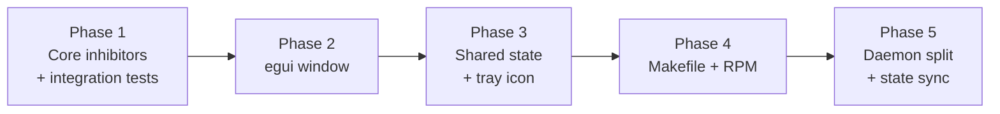

# Sleep Block — Implementation Plan

## Overview

Delivers a desktop utility that blocks system sleep on Linux, exposed through
two equivalent surfaces (a window and a tray icon) and shipped as a binary RPM.

The plan is **retrospective**: it records work already completed and verified,
with each task corresponding to a real revision in the repository. Phases are
ordered by dependency — the mechanism must exist and be provable before a
surface can display it, and both surfaces must share state before packaging is
meaningful.

## Non-Goals

Carried forward from `Specs/SleepBlock`:

- **Blocking lid-close suspend.** The desktop owns the lid switch; overriding it
  would fight the user's own power settings.
- **Faking input events.** Documented inhibitor APIs only.
- **Scheduling or timed auto-release.**
- **Cross-platform support.** The mechanisms are Linux-specific.
- **Persisting inhibitor state across restarts.**

Decided during planning:

- **No abstraction over the two inhibitor mechanisms.** Their release semantics
  differ, and a shared trait would hide the distinction that causes bugs.
- **No source RPM or clean-room build.** `make package` produces a binary RPM
  using the local toolchain; a mock or COPR build is deferred (see **Q-03**).
- **No notification machinery in the core crate.** The tray polls instead.

Revised in Phase 5:

- **The single-process design was abandoned.** It is impossible to hide or raise
  a window from within its own process on Wayland, so hide-to-tray required
  splitting the daemon from the window. The earlier note that this plan delivers
  a single binary no longer holds.

## Architecture

Two crates: a GUI-free core owning D-Bus and state, and a binary crate owning
both surfaces. Full detail in `Designs/SleepBlock`.

The phase order reflects a hard constraint rather than preference: the core is
testable headlessly, the surfaces are not, so proving the mechanism first is
what makes the rest verifiable at all.

## Key Decisions

- **Direct D-Bus calls over spawning `systemd-inhibit`** — ties lock lifetime to
  a file descriptor, so abnormal exit still releases (**FR-03**).
- **Two concrete inhibitor types, no unifying trait** — the logind lock is
  self-releasing; the ScreenSaver cookie is not.
- **`SleepBlock` shared handle** — required once the tray became a peer of the
  window (**FR-09**); neither surface is privileged.
- **`async-io` backend for `ksni`** — matches `zbus`, avoiding a second executor
  in-process.
- **Binary RPM, built by the Makefile** — a source RPM's `BuildRequires: rust`
  cannot see a rustup toolchain.

## Dependencies

- Rust toolchain (edition 2024).
- `systemd-logind` at runtime for sleep inhibition.
- A `org.freedesktop.ScreenSaver` provider for screen-lock inhibition.
- A StatusNotifierItem host for the tray; absence is non-fatal.
- `rpm-build` and `desktop-file-utils` for packaging.
- ImageMagick for regenerating icons (build-time only; PNGs are committed).
- `zbus` for the D-Bus contract between the daemon and the window, and
  `event-listener` for the daemon's shutdown signal — a one-shot notification
  that avoids polling or a channel for a single wakeup.
- `libc` (dev-dependency only) for `SIGSTOP`/`SIGCONT` in the test that proves a
  hung daemon cannot freeze the window.

## Plan Completion Evidence

- Verified: 2026-08-10
- Repository: ~/Development/Code/sleep-block
- VCS: git
- Revision / checkpoint: 38087c19f6b02eb63a4541f03afd33821095f501
- Identity recheck: git rev-parse HEAD, 2026-08-10 21:05, matches recorded revision 38087c19f6b02eb63a4541f03afd33821095f501

| Command | Working directory | Result | Observable evidence |
|---|---|---|---|
| `cargo test --release` | . | PASS (exit 0) | 8 tests passed: 5 inhibitor, 3 icon |
| `cargo clippy --release --all-targets -- -D warnings` | . | PASS (exit 0) | no warnings emitted |
| `cargo fmt --check` | . | PASS (exit 0) | no formatting diff |
| `desktop-file-validate dist/sleep-block.desktop` | . | PASS (exit 0) | no output; entry valid |
| `make package` | . | PASS (exit 0) | wrote sleep-block-0.1.0-1.fc44.x86_64.rpm |

### Completed phase identities

- `1`: `553f02db97710586570fcd1e1bab5b773eac7cb9`; review: Plans/SleepBlock/01-Core-Inhibitor-Mechanism.md
- `2`: `025c10c6e3c57569a531baa69509576c167b05ca`; review: Plans/SleepBlock/02-Window-Surface.md
- `3`: `8a5e549a3535b654c2a6fdfbee5af6346b164b98`; review: Plans/SleepBlock/03-Tray-Surface-And-Shared-State.md
- `4`: `38087c19f6b02eb63a4541f03afd33821095f501`; review: Plans/SleepBlock/04-Packaging.md

## Open Questions

- Should lid-close suspend be blockable behind an additional opt-in? — **non-blocking** — the plan delivers every stated requirement regardless; adding it would be a new opt-in, not a revision of delivered work.
- Should packaging target a clean-room build such as mock or COPR? — **non-blocking** — **FR-15** and **AC-11** are satisfied by the binary RPM this plan delivers; a clean-room build would be additive.
